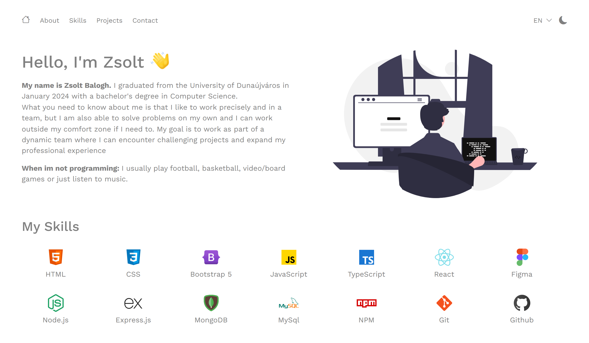
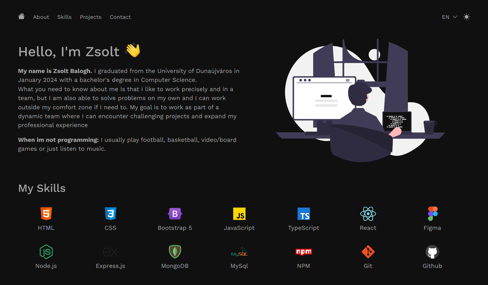
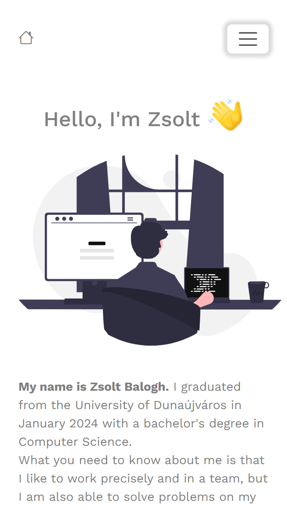
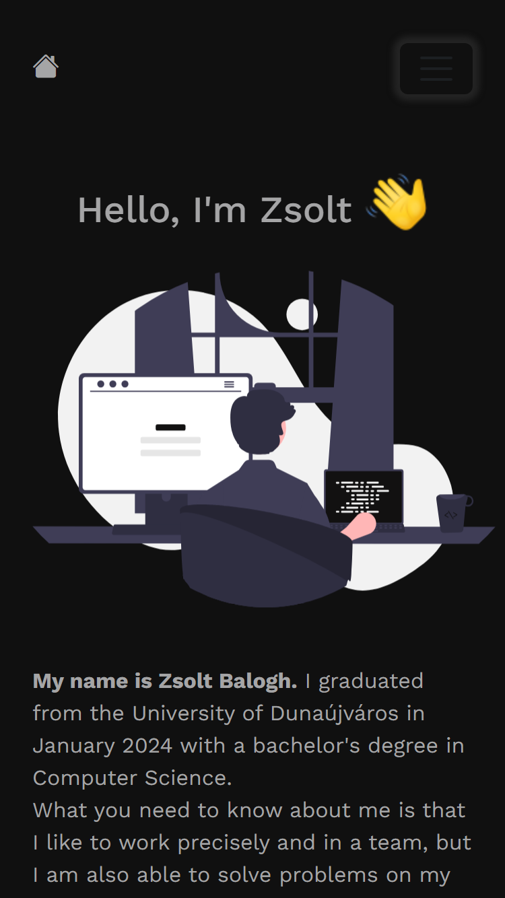

# My Portfolio Website

This project is my Portfolio website. For my portfolio I focused on making a clear and nice looking design with few animations to give life to the website.

## Table of contents

- [Overview](#overview)
  - [Built with](#built-with)
  - [Links](#links)
  - [Screenshot](#screenshot)

## Overview

### Built with

- HTML
- CSS custom properties
- TypeScript
- [Bootstrap](https://getbootstrap.com/)
- [React](https://reactjs.org/)
- [React Slick](https://react-slick.neostack.com/)

### Links

- [Click here to visit the website!](https://zsolt270.github.io/Portfolio/)

### Screenshot

